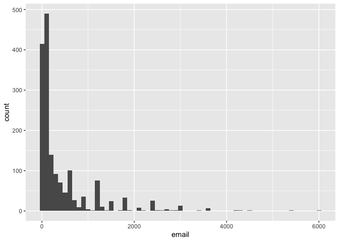
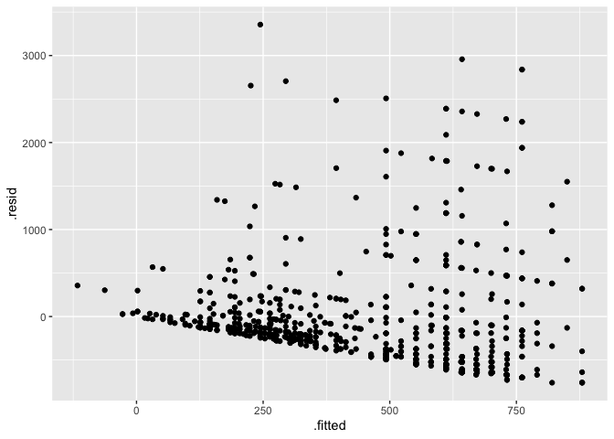
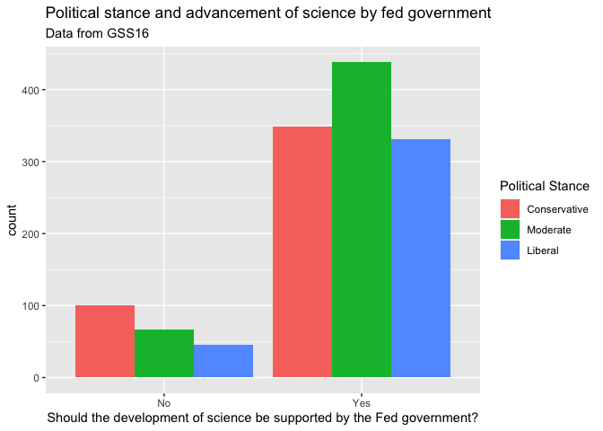
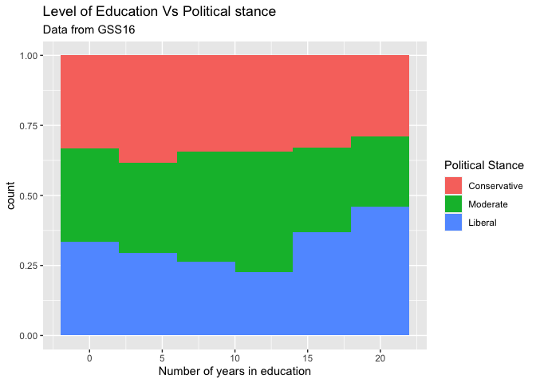

Final Project Part 1
================
Rumi Allbert
April 29, 2021

# Introduction

### Section 1: Harassment at work

  - #### Question 1: What are the possible responses to this question and how many respondents chose each of these answers?

  - ##### Answer: The possible responses are Does not apply (96), NA (1398), Yes (237), and No (1136)

<!-- end list -->

``` r
gss16 %>%
    count(harass5)
```

    ## # A tibble: 4 x 2
    ##   harass5                                                     n
    ##   <chr>                                                   <int>
    ## 1 Does not apply (i do not have a job/superior/co-worker)    96
    ## 2 No                                                       1136
    ## 3 Yes                                                       237
    ## 4 <NA>                                                     1398

  - #### Question 2: What percent of the respondents for whom this question is applicable (i.e. excluding NAs and Does not applys) have been harassed by their superiors or co-workers at their job.

  - ##### Answer: 17.26% of respondants for whom the question is applicable answered yes to being harassed by their superiors or co-workers at their job.

<!-- end list -->

``` r
gss16harass <-  gss16 %>%
    count(harass5)
gss16harass <-  gss16harass[-c(1,4),]
gss16harass
```

    ## # A tibble: 2 x 2
    ##   harass5     n
    ##   <chr>   <int>
    ## 1 No       1136
    ## 2 Yes       237

``` r
yes_percentage <- 237 / (1136 + 237)
message("Answered yes :" , yes_percentage*100 , "%")
```

    ## Answered yes :17.2614712308813%

### Section 2: Time spent on email

  - #### Question 3: Create a new variable called email that combines these two variables to reports the number of minutes the respondents spend on email weekly

  - ##### Answer:

<!-- end list -->

``` r
gss16 <- gss16 %>%
  mutate(email = emailhr*60 + emailmin)
select(gss16, email)
```

    ## # A tibble: 2,867 x 1
    ##    email
    ##    <dbl>
    ##  1   720
    ##  2    30
    ##  3    NA
    ##  4    10
    ##  5    NA
    ##  6   120
    ##  7  2400
    ##  8    NA
    ##  9     0
    ## 10    NA
    ## # … with 2,857 more rows

  - #### Question 4: Visualize the distribution of this new variable. Find the mean and the median number of minutes respondents spend on email weekly. Is the mean or the median a better measure of the typical among of time Americans spend on email weekly? Why?

  - ##### Answer: I believe that the median would be a better measure because as we can see in the illustration below, the data is skewed, and if we utilize the mean the estimate will be affected the the skew, whereas with the median the skew doesn’t affect the estimate.

<!-- end list -->

``` r
ggplot(gss16, aes(email)) + geom_histogram(binwidth = 100)
```

    ## Warning: Removed 1218 rows containing non-finite values (stat_bin).

<!-- -->

``` r
emailmedian <- median(gss16$email, na.rm=TRUE)
emailmean <- mean(gss16$email, na.rm = TRUE)
emailmedian
```

    ## [1] 120

``` r
emailmean
```

    ## [1] 416.8423

  - #### Question 5: Create another new variable, snap\_insta that is coded as “Yes” if the respondent reported using any of Snapchat (snapchat) or Instagram (instagrm), and “No” if not. If the recorded value was NA for both of these questions, the value in your new variable should also be NA

  - ##### Answer:

<!-- end list -->

``` r
gss16 <- gss16 %>%
  mutate(snap_insta = if_else(snapchat == "Yes" | instagrm == "Yes", "Yes", "No"))
select(gss16,snap_insta)
```

    ## # A tibble: 2,867 x 1
    ##    snap_insta
    ##    <chr>     
    ##  1 <NA>      
    ##  2 No        
    ##  3 No        
    ##  4 <NA>      
    ##  5 Yes       
    ##  6 Yes       
    ##  7 <NA>      
    ##  8 Yes       
    ##  9 <NA>      
    ## 10 No        
    ## # … with 2,857 more rows

  - #### Question 6: Calculate the percentage of Yes’s for snap\_insta among those who answered the question, i.e. excluding NAs

  - ##### Answer: The percentage of Ye’s for snap\_insta among those who answered the question is 17.93%

<!-- end list -->

``` r
snap_insta_yes <- gss16 %>%
  filter(snap_insta == "Yes") %>%
  nrow() / nrow(gss16) 
  
snap_insta_yes_percentage <- snap_insta_yes * 100
message(snap_insta_yes_percentage , "%")
```

    ## 17.9281478897803%

  - #### Question 7: What are the possible responses to the question Last week were you working full time, part time, going to school, keeping house, or what? and how many respondents chose each of these answers?

  - ##### Answer: The possible responses to the question are: Keeping house (284), Other (89), Retired (574), School (76) , Temp not working (57), Unempl, laid off (118), Working fulltime (1321), Working parttime (345), NA (3)

<!-- end list -->

``` r
gss16 %>% 
  count(wrkstat)
```

    ## # A tibble: 9 x 2
    ##   wrkstat              n
    ##   <chr>            <int>
    ## 1 Keeping house      284
    ## 2 Other               89
    ## 3 Retired            574
    ## 4 School              76
    ## 5 Temp not working    57
    ## 6 Unempl, laid off   118
    ## 7 Working fulltime  1321
    ## 8 Working parttime   345
    ## 9 <NA>                 3

  - #### Question 8: Fit a model predicting email (number of minutes per week spent on email) from educ (number of years of education), wrkstat, and snap\_insta. Interpret the slopes for each of these variables.

  - ##### Answer: One could interpret the slope in words by saying that for every additional year that one spends on education, there will be an increase in the amount of time spent on email weekly, 29.63 minutes more to be exact.

<!-- end list -->

``` r
email_fitting <- linear_reg() %>%
  set_engine("lm") %>%
  fit(email ~ educ + wrkstat + snap_insta, gss16)
tidy(email_fitting)
```

    ## # A tibble: 10 x 5
    ##    term                    estimate std.error statistic   p.value
    ##    <chr>                      <dbl>     <dbl>     <dbl>     <dbl>
    ##  1 (Intercept)               -230.     150.      -1.53  0.126    
    ##  2 educ                        29.6      9.60     3.09  0.00211  
    ##  3 wrkstatOther                33.1    209.       0.158 0.875    
    ##  4 wrkstatRetired              68.3    111.       0.615 0.539    
    ##  5 wrkstatSchool             -124.     144.      -0.860 0.390    
    ##  6 wrkstatTemp not working    -73.7    154.      -0.479 0.632    
    ##  7 wrkstatUnempl, laid off    118.     151.       0.783 0.434    
    ##  8 wrkstatWorking fulltime    367.      87.7      4.18  0.0000326
    ##  9 wrkstatWorking parttime     18.9    102.       0.186 0.853    
    ## 10 snap_instaYes              150.      52.7      2.84  0.00460

  - #### Question 9: Create a predicted values vs. residuals plot for this model. Are there any issues with the model? If yes, describe them.

  - ##### Answer:

<!-- end list -->

``` r
email_fit_aug <- augment(email_fitting$fit)
email_fit_aug
```

    ## # A tibble: 679 x 11
    ##    .rownames email  educ wrkstat       snap_insta .fitted  .resid    .hat .sigma
    ##    <chr>     <dbl> <dbl> <chr>         <chr>        <dbl>   <dbl>   <dbl>  <dbl>
    ##  1 2            30    12 Working full… No          493.   -463.   0.00545   642.
    ##  2 6           120    14 Keeping house Yes         335.   -215.   0.0179    643.
    ##  3 11          120    12 Keeping house No          126.     -5.85 0.0165    643.
    ##  4 13          600    12 Working part… No          145.    455.   0.0121    642.
    ##  5 15           30    10 Temp not wor… No           -7.12   37.1  0.0483    643.
    ##  6 19           60    18 Working full… Yes         820.   -760.   0.00809   642.
    ##  7 21         1500    12 Working full… No          493.   1007.   0.00545   641.
    ##  8 23           60    10 Working part… Yes         235.   -175.   0.0144    643.
    ##  9 28            0    14 Working part… Yes         354.   -354.   0.0114    643.
    ## 10 29           10    18 Retired       No          372.   -362.   0.0172    643.
    ## # … with 669 more rows, and 2 more variables: .cooksd <dbl>, .std.resid <dbl>

``` r
ggplot(email_fit_aug) + geom_point(aes(.fitted, .resid)) 
```

<!-- -->

### Section 3: Political views and science research

  - #### Question 10:

  - ##### Answer:

<!-- end list -->

``` r
gss16 <- gss16 %>%
  mutate(advscience = if_else(advfront == "Strongly agree" | advfront == "Agree", "Yes", "No"))
head(gss16)
```

    ## # A tibble: 6 x 12
    ##   harass5 emailmin emailhr  educ polviews   advfront  snapchat instagrm wrkstat 
    ##   <chr>      <dbl>   <dbl> <dbl> <chr>      <chr>     <chr>    <chr>    <chr>   
    ## 1 <NA>           0      12    16 Moderate   Strongly… <NA>     <NA>     Working…
    ## 2 <NA>          30       0    12 Liberal    Disagree  No       No       Working…
    ## 3 No            NA      NA    16 Conservat… <NA>      No       No       Retired 
    ## 4 <NA>          10       0    12 Moderate   Disagree  <NA>     <NA>     Working…
    ## 5 No            NA      NA    18 Slightly … <NA>      Yes      Yes      Working…
    ## 6 <NA>           0       2    14 Slightly … Strongly… No       Yes      Keeping…
    ## # … with 3 more variables: email <dbl>, snap_insta <chr>, advscience <chr>

  - #### Question 11: In a new variable, recode polviews such that Extremely liberal, Liberal, and Slightly liberal, are mapped to “Liberal”, and Slghtly conservative, Conservative, and Extrmly conservative disagree are mapped to “Conservative”. The remaining levels can be le as is. Make sure that the levels are in a reasonable order. Don’t overwrite the existing polviews, instead pick a dierent, informative name for your new variable.

  - ##### Answer:

<!-- end list -->

``` r
gss16 <- gss16 %>%
  mutate(simplepolviews = case_when(
    polviews %in% c("Extremely liberal", "Liberal", "Slightly liberal") ~ "Liberal",
    polviews %in% c("Slghtly conservative", "Conservative", "Extrmly conservative") ~ "Conservative", 
    TRUE ~ polviews
  ), simplepolviews = fct_relevel(simplepolviews, "Conservative", "Moderate", "Liberal"))
head(gss16)
```

    ## # A tibble: 6 x 13
    ##   harass5 emailmin emailhr  educ polviews   advfront  snapchat instagrm wrkstat 
    ##   <chr>      <dbl>   <dbl> <dbl> <chr>      <chr>     <chr>    <chr>    <chr>   
    ## 1 <NA>           0      12    16 Moderate   Strongly… <NA>     <NA>     Working…
    ## 2 <NA>          30       0    12 Liberal    Disagree  No       No       Working…
    ## 3 No            NA      NA    16 Conservat… <NA>      No       No       Retired 
    ## 4 <NA>          10       0    12 Moderate   Disagree  <NA>     <NA>     Working…
    ## 5 No            NA      NA    18 Slightly … <NA>      Yes      Yes      Working…
    ## 6 <NA>           0       2    14 Slightly … Strongly… No       Yes      Keeping…
    ## # … with 4 more variables: email <dbl>, snap_insta <chr>, advscience <chr>,
    ## #   simplepolviews <fct>

  - #### Question 12: Create a visualization that displays the relationship between these two new variables and interpret it

  - ##### Answer:

<!-- end list -->

``` r
gss16 %>%
  filter(!is.na(simplepolviews), !is.na(advscience)) %>%
  ggplot(aes(x = advscience, fill = simplepolviews)) +
  geom_bar(position = "dodge") + labs(
    title = "Political stance and advancement of science by fed government",
    subtitle = "Data from GSS16",
    x = "Should the development of science be supported by the Fed government?",
    fill = "Political Stance"
  )
```

<!-- -->

### Section 4: Individual question

  - #### Question 12: Are ‘high’ education people more liberal or conservative? Visualize the relationship between these variables.

  - ##### Answer: By observing the visualization below it is evident that the political stance of people who are ‘highly’ educated is more liberal than conservative or moderate. One can also observe that the higher the education, the more liberal people there will be. We can also observe that the distribution of people who receive about 12 years of education (high school) is almost evenly distributed.

<!-- end list -->

``` r
gss16 %>%
  filter(!is.na(simplepolviews), !is.na(educ)) %>%
  ggplot(aes(x = educ, fill = simplepolviews)) +
  geom_histogram(position = "fill", binwidth = 4) + labs(
    title = "Level of Education Vs Political stance",
    subtitle = "Data from GSS16",
    x = "Number of years in education",
    fill = "Political Stance"
  ) 
```

<!-- -->
